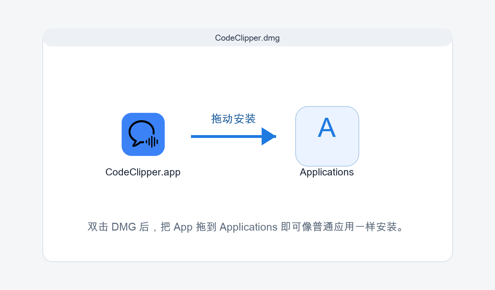
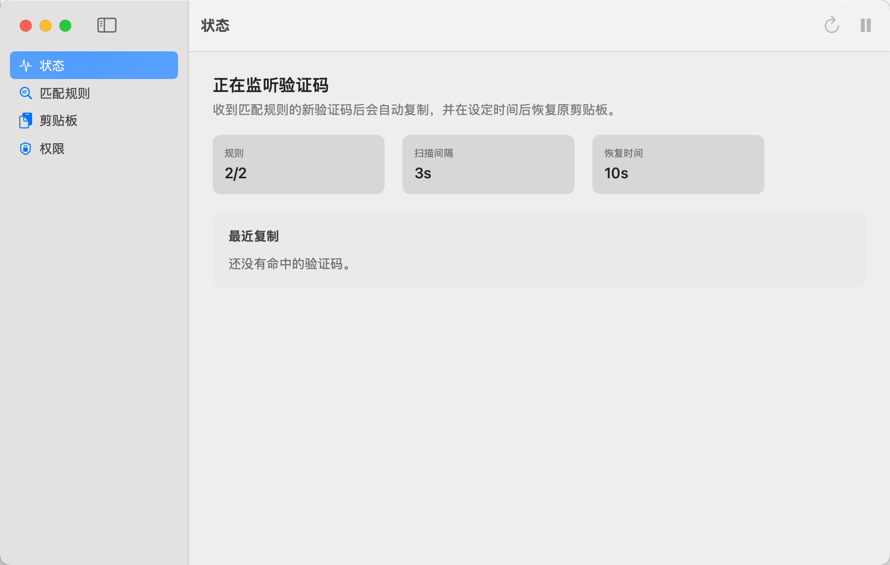

# CodeClipper

CodeClipper 是一款原生 macOS 菜单栏工具，用来自动读取“信息”里收到的验证码，复制到剪贴板，并在你设置的秒数后恢复原来的剪贴板内容。

[](https://github.com/yifu1024/code-clipper/releases/download/v1.1.0/CodeClipper-1.1.0.dmg)

## 功能

- 自动扫描最近收到的 iMessage / 短信验证码
- 命中规则后自动复制验证码到剪贴板
- 支持设置多少秒后恢复原剪贴板内容
- 复制和恢复时可发送系统通知
- 支持自定义正则匹配规则和捕获组
- 支持规则预设、开机启动、权限检测
- 作为菜单栏应用运行，不占用程序坞
- 支持 DMG 拖拽安装

## 下载

前往 GitHub Release 下载最新版本：

[下载 CodeClipper-1.1.0.dmg](https://github.com/yifu1024/code-clipper/releases/download/v1.1.0/CodeClipper-1.1.0.dmg)

也可以打开 Release 页面：

[https://github.com/yifu1024/code-clipper/releases/tag/v1.1.0](https://github.com/yifu1024/code-clipper/releases/tag/v1.1.0)

## 安装



1. 双击打开 `CodeClipper.dmg`
2. 将 `CodeClipper.app` 拖到 `Applications`
3. 从“启动台”、Spotlight 或“应用程序”里打开 `CodeClipper`
4. 打开后应用只显示在菜单栏

## 权限

CodeClipper 需要读取本机 Messages 数据库：

```text
~/Library/Messages/chat.db
```

macOS 会保护这个文件。如果应用提示未授权，请打开：

```text
系统设置 > 隐私与安全性 > 完全磁盘访问权限
```

然后添加：

```text
/Applications/CodeClipper.app
```

应用只在本机读取最近收到的信息并匹配验证码，不上传数据。日志不会记录短信正文或验证码内容。

## 使用



打开菜单栏图标，点击“打开设置”，可以配置：

- 是否启动后自动监听
- 是否开机自动启动
- 扫描间隔
- 消息回看时间
- 多少秒后恢复剪贴板内容
- 是否发送复制 / 恢复通知
- 验证码匹配规则

## 规则怎么写

规则使用正则表达式。应用会按照规则列表从上到下匹配短信内容，并复制指定捕获组。

常用规则：

| 场景 | 正则 | 捕获组 |
| --- | --- | --- |
| 6 位数字 | `(?<!\d)(\d{6})(?!\d)` | `1` |
| 4-8 位数字 | `(?<!\d)(\d{4,8})(?!\d)` | `1` |
| 带“验证码”关键字 | `(?:验证码|校验码|动态码)[^\d]{0,12}(\d{4,8})` | `1` |
| 冒号后数字 | `[:：]\s*(\d{4,8})(?!\d)` | `1` |
| 英文 code | `(?:code|Code)[^\d]{0,12}(\d{4,8})` | `1` |

如果规则里没有括号，可以把捕获组设置为 `0`，表示复制整个匹配结果。

## 本地构建

生成可安装的 DMG：

```sh
./script/package_app.sh
```

开发时直接构建并运行：

```sh
./script/build_and_run.sh
```

生成文件位于：

```text
dist/package/CodeClipper.dmg
```

## 分发说明

当前构建脚本使用本机 ad-hoc 签名，适合本机测试和早期分发。若要商业化分发，建议使用 Apple Developer ID 证书签名并进行 notarization，以减少 macOS 安全提示。
